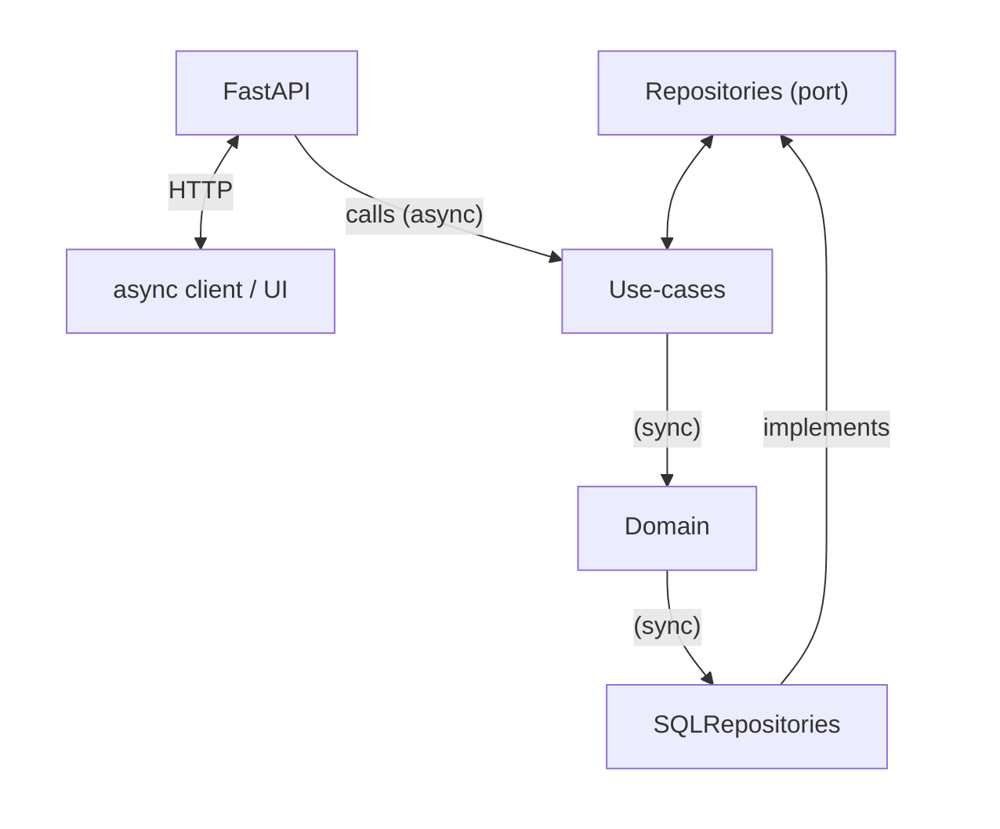
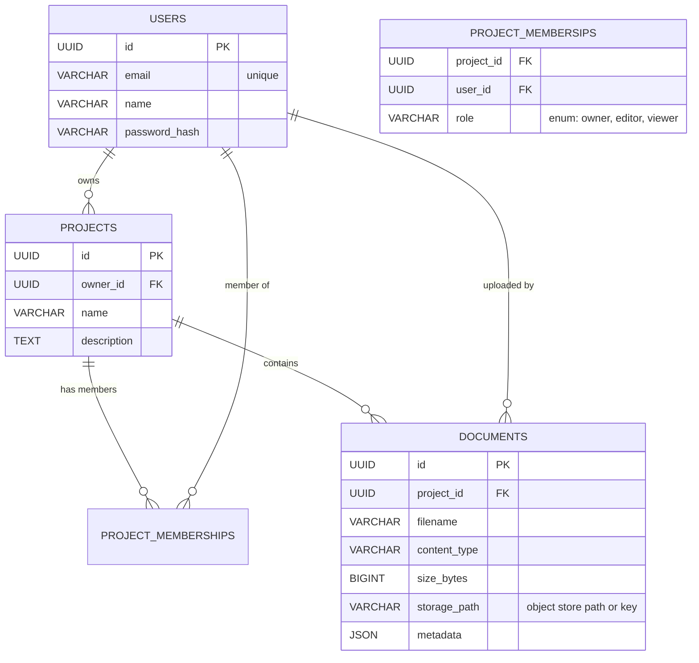

# Project Management Server

## ✨ Features

## 🚀 Quick Start
```
bash
# 1. (Optional) create & activate a virtual environment
python -m venv .venv && source .venv/bin/activate  # Linux/macOS
# .venv\Scripts\activate                           # Windows PowerShell

# 2. Install the dependencies
pip install -r requirements.txt

# 3. Run the development server (auto-reload enabled)
python ./app/main.py
```

Navigate to <http://localhost:8000/docs> for the interactive Swagger UI 🚀
## 🗂 Project Structure
```
app/
    domain/
    ports/
    adapters/
    usecases/
    api/
    main.py
tests/             
```
---

## 🔌 HTTP API Overview

| Method | Path | Description | Status |
| :-- | :-- | :-- | :-- |
| POST | /auth/create_user | Create a new user | 201/400 |
| POST | /auth/login | Authenticate user and receive JWT token | 200/401 |
|
| GET | /projects/ | Get all accessible projects (owned + shared) | 200 |
| POST | /projects/ | Create project  | 201 |
| GET | /projects/{project_id}/info | Get project details | 200/404 |
| PUT | /projects/{project_id}/info | Update project name and description | 200/404 |
| DELETE | /projects/{project_id} | Delete a project and its documents | 200/404 |
| GET | /projects/{project_id}/documents | List documents in a project | 200/404 |
| POST | /projects/{project_id}/documents | Upload one or multiple documents to a project | 201/404/415 |
| POST | /projects/{project_id}/invite | Grant a user access to a project | 200/400/404 |
|
| GET | /documents/{document_id} | Download a document | 200/404 |
| PUT | /documents/{document_id} | Update document content or metadata | 200/404 |
| DELETE | /documents/{document_id} | Delete a document | 200/404 |

> OpenAPI documentation is served automatically at `/docs` (Swagger UI) and `/redoc`.

## 🧱 Architecture



## Data Base Schema
